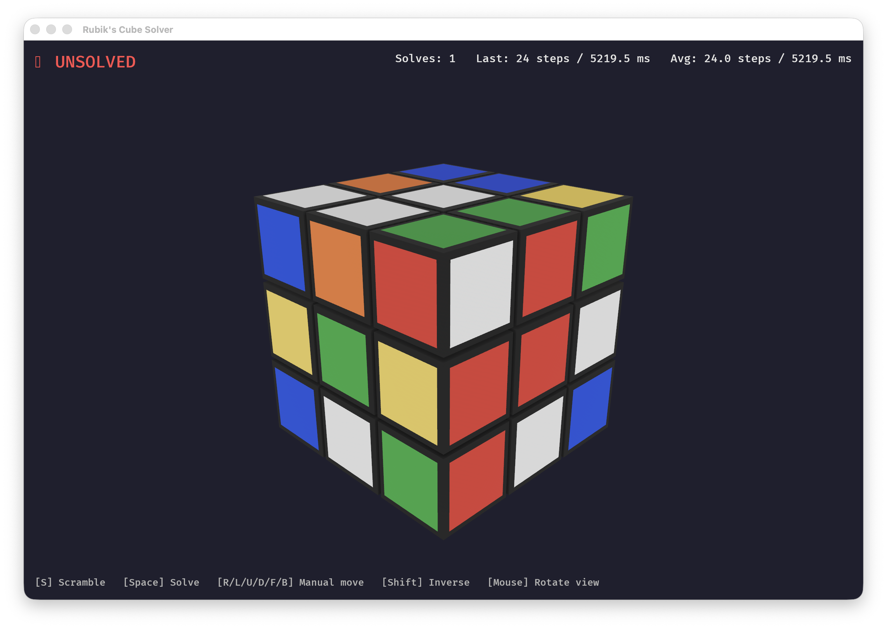

# 🧊 Rubik's Cube Simulator & Solver

[](https://github.com/vikman90/rubik/actions/workflows/build.yml)

A high-performance, cross-platform 3D Rubik's Cube simulator written in Rust using the [Bevy Engine](https://bevyengine.org/). Features smooth visual rotation animations and an asynchronous [Kociemba Two-Phase algorithm](https://kociemba.org/cube.htm) solver that can calculate the optimal solution for any scrambled state in milliseconds.



## ✨ Features
- **3D Visualization**: Fully controllable orbital camera and smooth piece-by-piece rotation animations.
- **Robust State Engine**: Mathematical internal 54-facelet representation prevents floating-point drift and hardware anomalies.
- **Lightning-Fast Solver**: Integrated Kewb asynchronous background solver. Reconstructs any scrambled cube without freezing the UI.
- **HUD & Stats**: Tracks unsolved/solved state alongside history timers, lengths, and speed records.
- **Cross-Platform**: Compiles natively for macOS, Linux, and Windows.

## 🚀 Getting Started

Ensure you have [Rust and Cargo](https://rustup.rs/) installed on your machine.

1. Clone the repository:
   ```bash
   git clone https://github.com/vmfdez90/rubik.git
   cd rubik
   ```
2. Run the application:
   ```bash
   cargo run --release
   ```

## 🎮 Controls

### Camera
- **Left Click + Drag**: Orbit/Rotate the camera around the cube.
- **Scroll Wheel**: Zoom in and out.

### Face Rotations (Manual)
Use the keyboard to rotate the faces mathematically (Standard Rubik's Notation):
- **`U` / `Shift+U`**: Up face (Clockwise / Counter-Clockwise)
- **`D` / `Shift+D`**: Down face
- **`F` / `Shift+F`**: Front face
- **`B` / `Shift+B`**: Back face
- **`R` / `Shift+R`**: Right face
- **`L` / `Shift+L`**: Left face

### Engine Triggers
- **`S`**: **Scramble**. Randomly shuffles the cube with a 20-move sequence.
- **`Spacebar`**: **Solve**. Triggers the Kociemba algorithms to optimally resolve the scrambled state and plays the solution animation automatically.

## 🛠️ Built With
* [Rust](https://www.rust-lang.org/)
* [Bevy 0.15](https://bevyengine.org/) - Data-Driven Game Engine
* [kewb](https://crates.io/crates/kewb) - Kociemba's Two-Phase Algorithm

## 📄 License
This project is licensed under the MIT License - see the [LICENSE](LICENSE) file for details.
